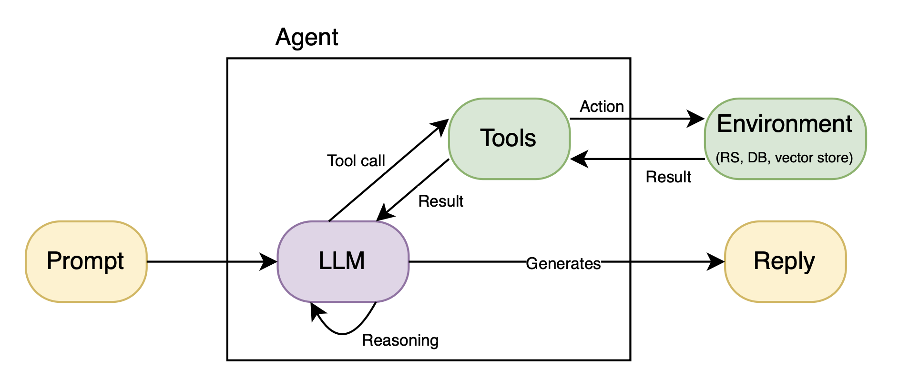

# LLM-based Recommendation System Agents

Recommendation system agents are LLM-based agents that can effectively answer user queries about recommendations by interacting with external tools, like recommendation engines, databases, and vector stores.

The core idea of recommendation system agents is to decouple the LLM assistant from the recommendation system engine, instead of plugging recommendation capabilities directly into the weights of the LLM model.

By doing so, both components can do what they have been designed for at their best. On the one hand, the LLM can understand and reason about complex queries made by the user. On the other hand, the recommendation engine can generate rankings of items given user and item IDs that are provided by the LLM agent.

## Premise

In the first stages of this project, we dove into the LLM-based recommendation literature. In particular, we discovered three main techniques of integrating recommendation systems and LLM models:

### 1. LLMs are used for content-based sequential recommendation (feature extraction)

In this spectrum of works, the LLM is purely used as a feature extractor. The textual content features of an item are passed to an LLM that generates the item representation. Then, the items in the history of the user are passed to this LLM. The LLM generates the embeddings for these items that are then aggregated to form the user representation. To understand if an item has to be recommended, the dot product between the user representation (formed by the aggregated embeddings computed by the LLM) and the target item representation is computed. In these kinds of works, the LLM needs minimal fine-tuning to adapt its space to the specific features of the recommendation dataset. It has been shown that these approaches can improve the sequential recommendation performance. 

The main drawback of these works is that the LLM capabilities are only exploited to extract some content features, so no LLM's advanced reasoning is taken into account. This means the LLM does not directly provide recommendations or reasons about user and item relationships. 

An illustration of this category of works is depicted in the following figure taken from the [paper](https://dl.acm.org/doi/10.1145/3616855.3635845): `ONCE: Boosting Content-based Recommendation with Both Open- and Closed-source Large Language Models`.


### 2. LLMs are used for the next item title prediction in sequential recommendation systems (mapping to the LLM token space)

In these kinds of works, the user and item representations (i.e., embeddings) are first pre-trained using different techniques depending on the specific work. After that, a user encoder and an item encoder are learned to translate the user and item representations into the token space of the LLM model, so that users and items become internal tokens that the LLM can reason about. The training procedure of these encoders is depicted in the following figure taken from the [paper](https://dl.acm.org/doi/10.1145/3637528.3671931): `Large Language Models meet Collaborative Filtering: An Efficient All-round LLM-based Recommender System`.


As you can see from the figure, the LLM is frozen. The prompt for the training is prepared so that the user and item representations are represented as token embeddings after the embedding layer of the LLM. Note that this is an interesting trick because it does not require enlarging the vocabulary of the LLM for the LLM to reason about new tokens (i.e., user and item tokens). By doing so, the LLM remains untouched. The two encoders are simply learned so that the LLM is always able to reconstruct the correct title given a pool of 20 candidate item titles.

We found this work very interesting and novel. However, in real-world recommendation scenarios, it is the job of the recommender system to find plausible candidate items to then generate a ranking for the user. We discovered that if the candidate items are removed from the prompt at inference time, the test performance of the system dramatically drops. Hence, the main drawback of these works is twofold. First, the LLM is only able to predict the next item title, while, usually, recommendation systems work with user and item IDs. Second, these systems always need a pool of candidate items to be provided in the prompts, and this is impossible in real-world scenarios.

### 3. LLMs are fine-tuned on the recommendation task (fine-tuning of the LLM)

The idea of these works is to convert the recommendation task into a natural language processing task, where prompt templates for the fine-tuning of the model are constructed in such a way that given the input (e.g., the item IDs in the history of the user) the LLM has to predict the output (e.g., the item ID of the next item the user will click on). Examples of these prompt templates are shown in the following figure taken from the [paper](https://dl.acm.org/doi/10.1145/3523227.3546767): `Recommendation as Language Processing (RLP): A Unified Pretrain, Personalized Prompt & Predict Paradigm (P5)`.


On the left part of the figure, there is the input, while on the right part, the output. As you can see from the figure, different recommendation tasks can be performed by the same LLM thanks to the fact that all these tasks can be translated into natural language prompts for the fine-tuning of the LLM model. Interestingly, since these tasks are converted to text, the classical negative log-likelihood loss for LLM training can be used as the only loss for fine-tuning the LLM on all these tasks together. 

We found these works interesting and novel; however, the recommendation performance measured in terms of offline ranking metrics such as NDCG and Hit ratio is bad compared to standard recommendation systems (e.g., under 0.1), indicating the LLM models struggle to learn these kinds of user-item relationships. One of the main issues that might explain the poor performance of these models is that user and item IDs are provided to the LLM. The LLM is pre-trained on language tasks, so it struggles to understand the differences between different numerical IDs. Instead, this difference is crucial for recommender systems, especially in sequential recommendation tasks, where the order of these IDs in the user history is very important. The LLM struggles to understand this ordering.

Additionally, user and item IDs can be subdivided into multiple LLM tokens, meaning the representation of one user or item is shared between different token embeddings, making it difficult for the LLM to learn standalone user and item representations. Attempts have been made to treat each item and user ID as a special token. However, as the catalog of the recommendation platform increases in size, the number of tokens to be added to the LLM vocabulary also increases, making it really challenging for the LLM to be trained effectively. First, the embedding store becomes massive. Second, it becomes really challenging for the softmax at the last linear layer to predict the next token correctly, due to the massive number of plausible next tokens.

By interacting with the authors of P5, we also discovered additional information that is worth sharing. They made tests with two different LLM backbones, [T5](https://arxiv.org/abs/1910.10683) and [Llama-7b](https://arxiv.org/abs/2302.13971). They discovered that the more the LLM is capable, the worse the performance on the recommendation task, meaning fine-tuning becomes more and more complex with very big Large Language Models. 

Since we are going towards agentic frameworks research, we need good chatbot capabilities (capable LLMs). For this reason, we need to find ways to make recommendation systems work with very big LLM models.

## Our idea

It seems more and more clear from the literature that designing foundation models tailored to the recommendation task is not the right direction, as the tasks of natural language understanding are very different from the recommendation task. For this reason, after many months of failed research about plugging recommendation system capabilities inside LLMs (with pre-training, fine-tuning, or training from scratch), we thought of a novel and promising research direction.

The core question is: why do we not leave the LLM and the recommendation system to do what they can do at their best instead of plugging one into the other?

LLMs are very good at natural language understanding, complex query understanding, textual reasoning, and question answering. Recommendation systems, on the other hand, are specifically designed to provide recommendations.

That is why we decided to move towards LLM-based Recommendation System Agents, where LLMs are assistants designed to answer complex recommendation queries. To answer these complex queries, LLMs can interact with external tools, like recommendation system engines. The tools provide some results, and the LLM can reason about them or use them as additional context to prepare the final answer for the user.

By doing so, there is no risk of hallucinations of user and item IDs by the LLM, as, in the end, it always has to interact with a recommender system that provides rankings narrowed to the item catalog.

## Advantages w.r.t. current literature

The proposed direction has many advantages:

1. The LLM is not fine-tuned or trained from scratch. A standard pre-trained (on natural language tasks) LLM can be used. This makes it possible for researchers and practitioners with poor computational resources to research in this field.
2. The task of recommendation is left to the recommendation system, avoiding hallucinations or complex recommendation reasoning by the LLM.
3. Minimal effort into the design of the Python code for the logic of the tools the LLM can interact with.
4. AI inference providers can be used to access the LLM, making it possible to run the entire infrastructure on a basic laptop.

## Infrastructure

The infrastructure of this project includes different components that interact each other:

1. A pre-trained recommendation system that the LLM can access. In this project, we use a simple Matrix Factorization model trained on the MovieLens-100k dataset using the [RecBole](https://recbole.io/) recommendation framework.
2. A MySQL database containing content information about users and items that can be accessed by the LLM to get textual descriptions of users and/or items.
3. A [Qdrant](https://qdrant.tech/) vector store containing embedded item descriptions that can be used by the LLM to answer ambiguous or complex queries where the recommendation system is not enough to provide a comprehensive reply. This vector store is run inside a Docker container.
4. An LLM model, either self-hosted or accessible through AI inference providers. In our case, we experimented with GPT4.1 (closed-source and accessed through an OpenAI API key), Qwen2.5-7B, and Qwen2.5-72B (open-weight and self-hosted). The only requirement is that the LLM has function-calling capabilities.
5. An API to make the LLM interact with the user-defined tools. This is also called the middleware layer. This layer has to detect function calls, call the correct function, and return the result to the LLM. In our project, we use the [LangChain/LangGraph](https://www.langchain.com/) framework.
6. A front-end app for a smooth interaction between the user and the LLM. In this project, we used [Chainlit](https://docs.chainlit.io/get-started/overview).

## Function calling workflow

For researchers and practitioners new to this topic, the function calling workflow can be summarized as:

1. The user asks a query.
2. The LLM needs to understand if the query requires calling an external tool or if it can be answered using its internal knowledge. The LLM is able to understand this also thanks to a system prompt, namely, a prompt that is sent to the LLM before the interaction with the user starts. This special prompt contains instructions to instruct the LLM about the tool calling process, specifically, when it has to access external tools.
3. If the LLM detects that a tool call is needed, it has to generate a JSON file containing the name of the function that has to be called, plus the parameters for invoking this function.
4. The tool is invoked, and the logic is executed.
5. The tool returns the results to the LLM as text or JSON semi-structured data.
6. The LLM reasons about the results and decides whether to directly answer using the returned information, ask additional information from the user to better answer (i.e., human-in-the-loop), or call additional tools.
7. The LLM generates the final answer.

The tool call procedure is depicted in the following figure.



## Recommendation dataset

For this project, we used the notable MovieLens-100k dataset enlarged with movie metadata scraped from the [IMDb](https://www.imdb.com/) database. In particular, we scraped the following information about items:

1. Title
2. Genres
3. Director
4. Producer
5. Actors
6. Release date
7. Country
8. Duration	
9. IMDb rating
10. Number of reviews on IMDb
11. Description
12. Storyline


## Recommendation assistant capabilities

First of all, note that this assistant is designed to answer questions asked by the streaming platform owner. For this reason, when asking for recommendations, you should always provide the user ID in your question; otherwise, the LLM assistant will ask for it.

Our assistant can currently respond to these kinds of questions:

1. Recommendation questions:
- Recommend some movies to user 4.
2. Constrained recommendation questions that require access to an external database for item filtering:
- Recommend a Tom Cruise movie to user 9.
- Recommend 3 comedy movies to user 98.
- Recommend some movies starring Tom Cruise and with an IMDb rating higher than 6 to user 2;
- Recommend some movies released in the USA prior to 1997 to user 9.
3. User's mood-based recommendation questions:
- User 6 is very sad today. What could we recommend to him?
- User 9 is happy, suggest some movies that match his/her emotional state.
4. Questions that require vector store searches:
- Recommend to user 8 some movies that are similar to movie 9.
- Recommend to user 2 some movies that match this storyline/description: <description>.
- Recommend to user 9 some movies where the main character is kidnapped.
5. Questions about streaming platform statistics:
- What might be the percentage of users interested in this storyline? <storyline>.
- What is the ideal content length for comedy genre movies?
- What is the most engaging movie genre during the Christmas holidays?
6. Questions about the historical interactions of the users:
- What are the historical interactions of user 90?
7. Questions about item metadata:
- Provide the title and description of item 9.
8. Questions about user metadata:
- What is the age category of user 198?

**EXTRA 1**: After each recommendation, the assistant asks if the user would like an explanation for the recommended items. If the user replies positively, the assistant will provide an explanation based on the content-based similarities between recommended items and the most recent items the user interacted with in the past.

**EXTRA 2**: After the assistant provides an answer, the user can always ask for more details regarding each step or tool the assistant used in the process to prepare the final answer. The assistant will try to make the process clearer to the user.

**EXTRA 3**: The assistant is instructed to explain to the user the steps it is using to prepare the answer, for example, which tools it is using and the reason why it decided to call them.

## Implemented tools

The assistant can autonomously decide which tools to call and in which order.

These are the available tools to date:

1. `get_top_k_recommendations`: takes as input a user ID and a number (i.e., k) of desired recommended items, and it generates a ranking over these items using the pre-trained recommender system. It can optionally take item IDs as input, for example, when the recommended items must satisfy some user's given conditions.
2. `item_filter`: takes as input some user's conditions and returns a list of IDs of items that satisfy the given conditions. Alternatively, it can generate the path to a .txt file containing these IDs. This is done for efficient use of streamed tokens.
3. `vector_store_search`: takes as input a query and performs a search in the vector database. The IDs of the top 10 matching items are returned. The vector database contains embedded item descriptions/storylines.
4. `get_like_percentage`: takes as input a list of item IDs and computes the percentage of users that like those items in the recommendation dataset.
5. `get_popular_items`: generates a list of popular items by computing the .75 quantile `q` of the rating distribution. The items with more than `q` ratings are considered popular. If some item IDs are given to this tool, it only takes the given items into account for the popularity computation.
6. `get_user_metadata`: takes as input a user ID and a list of desired metadata user features and returns the requested features.
7. `get_item_metadata`: takes as input an item ID and a list of desired metadata item features and returns the requested features.
8. `get_interacted_items`: takes as input a user ID and returns the IDs of the items the user interacted with in the past. It returns only the most recent 20 ones if the user interacted with more than 20 items in the dataset.

## Do you want to implement your custom tools?

Creating additional tools and binding them to the LLM assistant is straightforward. You just need to create a new Python file containing the logic of the tool and put it inside the folder `./src/tools`.

To define the tool, you can take inspiration from the tools already available in this project. You just have to remember to define the [Pydantic](https://docs.pydantic.dev/latest/) schema of the tool input, use the LangChain `@tool` decorator when defining the tool function, and return a string containing the JSON reply of the tool. 

We provide here a code snippet with an initial skeleton:

```

import json
from pydantic import BaseModel, Field
from langchain_core.tools import tool
from typing import List, Union

class InputSchema(BaseModel):
    """Schema for the input of the defined tool."""
    integer_input: int = Field(..., description="Integer input.")


@tool(args_schema=InputSchema)
def my_custom_tool(integer_input: int) -> str:
    """Tool description. Note that this description is read by the LLM to understand what the tool does. Hence, you should write a meaningful description."""
    
    # check if the input has been passed correctly to the tool
    if integer_input is None:
        return json.dumps({
            "status": "failure",
            "message": "Error while processing the input to the tool."
        })

    # Define the tool logic here. You might want to use the input and manipulate it.

    # This is the final response that is sent back to the LLM. 'message' is a string containing the actual response.
    # 'data' is a data structure containing any data related to the response (e.g., a list of item IDs)
    return json.dumps({
        "status": "success",
        "message": message,
        "data": data
    })

```

After you have defined the tool logic, you just need to bind the tool to the LLM agent. To do that, go into `./chainlit_example.py`, import your tool, and add it to the `tools` list.

After this, you should be able to start the application and see that the LLM is using your custom tool when needed.

If you are having issues creating your custom tools, we also invite you to follow this simple LangGraph [guide](https://langchain-ai.github.io/langgraph/agents/agents/).

## Important considerations on LLM model selection

The majority of our experiments have been done using the closed-source GPT4.1. In our opinion, this is the best model when it comes to native function-calling capabilities, multi-step reasoning, and integration with the LangChain/LangGraph framework. In our experiments, GPT4.1 rarely made mistakes, even for very complex queries requiring more than three tool calls. If you want a smooth conversation flow, this is the model to go for. The drawback is that you need to pay for an OpenAI API key.

For practitioners and researchers who cannot access GPT4.1, we decided to extend this project to the investigation of open-weight models that can be self-hosted on a laptop or cluster with GPUs. In this demo, open-source models can be self-hosted through Ollama.

We made experiments with all the models available in Ollama that can support native function calling. The [Qwen2.5](https://ollama.com/library/qwen2.5/tags) model family has been the one that provided the best results in our scenario. We tried with the 7B model, with different quantizations, on a MacBook Pro (M4 Pro / 24 GB). Then, we tried with the 72B model on four NVIDIA L40S GPUs with 48 GB of VRAM.

Due to the inferior capability of these models with respect to GPT4.1, it is not guaranteed that system prompt instructions are always carefully followed. Additionally, even if comprehensive examples are provided in the system prompt, this model family can forget to call some tools or can call wrong or useless tools. However, the more the model is capable, the better the function-calling and multi-step reasoning performance. Hence, if you have the chance to self-host Qwen2.5-72B on your cluster, we suggest you go for it. In our opinion, it is the best open-source model for this recommendation scenario.

These issues might be solved by implementing the tool's calling logic from scratch, instead of relying on the LangGraph/LangChain framework. The idea is to leave to the LLM the only task of generating the tool call plan as a list of JSON files containing function names and parameters. The self-implemented middleware layer must then understand that some JSONs have been generated, parse and validate them, and finally call the right tools and return the results to the LLM. As this is not a trivial task, we leave this for future work. We invite the reader to follow this [repository](https://github.com/frankie336/entities_api) for an open-source API that does exactly this. We tried this API in the early stages of this project. It works relatively well, and it is constantly updated.

## Prerequisites

- You should have [Docker](https://www.docker.com/) and [Conda](https://www.anaconda.com/docs/getting-started/miniconda/main) installed.
- If you want to use the OpenAI inference provider, you must have an OpenAI API subscription.
- If you want to self-host your model, you should have [Ollama](https://ollama.com/) installed.

## Installation instructions

First of all, clone this repository.

Then, run the following commands in the root directory of the project:

1. `conda create --name <env> python=3.12`
2. `conda activate <env>`
3. `pip install -r requirements.txt`

## Execution instructions

First of all, you need to perform the training of the recommendation system on the MovieLens-100k dataset. This is done by using the RecBole framework. This step should take a few minutes as the recommender is a basic Matrix Factorization model trained using BPR. 

To train the recommendation model, just run the following command from the folder `./data/ml-100k/`:

`python recsys_training.py`

This command should create a `.env` file for you containing the path to the weights of the pre-trained recommendation model.

After the successful training of the model, you must start Docker.

If you want to self-host your model on the CPU, we suggest using [Qwen2.5-7B](https://ollama.com/library/qwen2.5:7b) (we tested this model a lot). To use this model, you should first download it from Ollama.

To do so, be sure you have Ollama installed and then launch this command in your terminal:

`ollama pull qwen2.5:7b`

Instead, if you prefer to use the OpenAI inference provider, you must add an OpenAI API key to the .env file, for example, `OPENAI_API_KEY=<your_key>`.

Finally, you can run the application by running the following command from the root folder of the project:

OpenAI provider option: `python app_main.py` --> We do not currently support other OpenAI closed-source models, so we do not give the option to change the LLM when using the OpenAI inference provider.

Ollama self-hosting option: `python app_main.py --self_host` --> By default, our application uses Qwen2.5:7b. If you want to change the self-hosted LLM, you can use the following command (assuming the chosen model is [Qwen2.5:72b](https://ollama.com/library/qwen2.5:72b)):

`python app_main.py --self_host --llm Qwen2.5:72b`

All Ollama models with function-calling capabilities are supported. [Here](https://ollama.com/search?c=tools) is a list.

**Attention**: When self-hosting, be sure you have enough RAM or VRAM to load and use the chosen model.

## Do you need to self-host on a GPU that is on a remote cluster?

Make sure that Ollama is installed on the cluster. Then, launch this command on your cluster (assuming you want to use the [Qwen2.5-72B](https://ollama.com/library/qwen2.5:72b) model):

`ollama pull qwen2.5:72b`

Then, run the model on the cluster by launching:

`ollama run qwen2.5:72b`

Once the model is running, create a tunnel from your local laptop to your remote cluster where Ollama is running. You can do this by opening the terminal and launching the command:

`ssh -L 11434:localhost:11434 user@host_address`

Be sure you do not have Ollama working on your local laptop. If it is working, stop it.

Everything is now set up. It is enough that you launch the command:

`python app_main.py --self_host --llm Qwen2.5:72b`

If tunneling is set up correctly and your model is running with Ollama in your remote cluster, the application should successfully connect to that Ollama instance, and you should now be able to interact with your LLM assistant.

## Issues with RecBole while training or using your model with our agent?

While running the training of the recommendation model or the recommendation model inference while using our agent, sometimes, you might get some issues with RecBole in the files `trainer.py` or `quick_start.py`. The issue is related to a missing `weights_only=False` parameter while calling `torch.load()`. This is an issue of RecBole. The fix is provided as follows:

`checkpoint = torch.load(checkpoint_file, map_location=self.device)` ---> `checkpoint = torch.load(checkpoint_file, map_location=self.device, weights_only=False)`

Note that if you face the issue during training, you should fix the issue, then remove the folders RecBole created (i.e., `./data/ml-100k/log`, `./data/ml-100k/log_tensorboard`, and `./data/ml-100k/saved`), and finally re-run the training.

Instead, if you face the issue while using our agent (i.e., inference time), you should terminate the execution of the application, fix the issue, and re-run the application from scratch.

## Issues with Chainlit port?

Sometimes, Chainlit might tell you that the port `8000` at `localhost` is already used. In that case, instead of running the application by the command `python app_main.py`, you can try running it with the following command:

`chainlit run chainlit_example.py --port <your_desired_port>`

This should fix the issue.

## Do you want a different recommendation model or dataset?

Our project currently uses the RecBole framework to train and run the underlying recommendation model. 

As stated previously, our agent relies on a simple Matrix Factorization model trained on the MovieLens-100k dataset using the Bayesian Personalized Ranking criterion. This is enough for the nature of this demo, which simply aims to show a novel and promising way to make a Large Language Model interact with a recommendation system engine.

However, if you need a different recommendation model or dataset, you can easily change them by going to the file at this path: `./data/ml-100k/recsys_training.py`.

Look for the line:

`run_recbole(model='BPR', dataset='ml-100k', config_file_list=['./bprmf-100k.yaml'])`

As you can see, the model is BPR (Bayesian Personalized Ranking) and the dataset is ml-100k (MovieLens-100k). Then, you can see we are pointing to a configuration file. This file just contains the validation metric we are using (i.e., NDCG@5). It can additionally contain the hyper-parameters of the selected model, plus other important parameters, such as pre-processing techniques for the dataset. 

We suggest you follow the quick start guide of the RecBole framework to understand this config file and how the framework works: https://recbole.io/docs/get_started/started/general.html.

We also share the list of available RecBole models from which you can select your desired model: https://recbole.io/docs/user_guide/model_intro.html.

Is your model not in this list? You can simply decide to contribute to the RecBole framework and propose the implementation of your model with a Pull Request on their project. 

Is your model proprietary, and can you not make it public? Then, you can change the `get_top_k_recommendations` tool logic so it uses your model instead of relying on the RecBole framework. The tool implementation is available at this path: `./src/tools/get_top_k_recommendations.py`.

If you have already run the training of our default model and you want to test our agent with a different model, we suggest you delete the folders created by RecBole before starting the new training. The folders are created inside `./data/ml-100k` and are `./data/ml-100k/log`, `./data/ml-100k/log_tensorboard`, and `./data/ml-100k/saved`. Removing these folders will make sure that the training will be successful and the model will be correctly used by our agent.

Regarding the dataset, please be aware that our tools (especially `get_item_metadata` and `item_filter`) assume the previously itemized item features to be present in the dataset to work. If your dataset does not contain these features, you will have to change the logic of these tools to match your dataset. 
